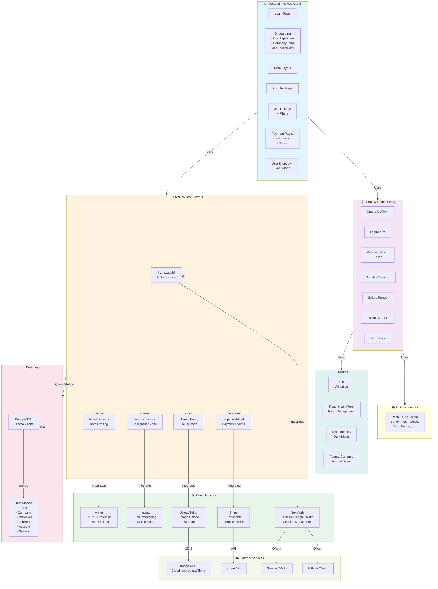

# Job Marshal - Project Architecture

## Overview

Job Marshal is a full-stack Next.js application for connecting companies and job seekers. The system uses modern web technologies with a focus on security, payments, and background job processing.

## Architecture Diagram



## Key Components

### Frontend (Client)

- **Pages**: Login, Onboarding, Main Layout, Post Job, Job Listings, Payment Success/Cancel
- **Features**: Dark mode toggle, user dropdown, responsive design

### Forms & Components

- Form components for job creation, login, and onboarding
- Rich text editor (TipTap) for job descriptions
- Specialized selectors for benefits, salary ranges, and job duration
- Job filtering components

### UI Library

- Built on Radix UI with custom Tailwind CSS styling
- Consistent component library across the app

### Backend API Routes

- **Authentication**: NextAuth for OAuth and session management
- **Payments**: Stripe webhook integration
- **File Uploads**: UploadThing integration
- **Background Jobs**: Inngest for async processing
- **Security**: Arcjet for rate limiting and DDoS protection

### External Services

- **OAuth**: GitHub and Google authentication
- **Payments**: Stripe
- **Storage**: Cloudinary and UploadThing CDN
- **Background Processing**: Inngest

### Database

- **PostgreSQL**: Primary database
- **Prisma ORM**: Database access layer
- **Models**: User, Company, JobSeeker, JobPost, Account, Session

### Data Models

```
User (Central Model)
├── Company (1:1 relation)
├── JobSeeker (1:1 relation)
├── Account[] (OAuth credentials)
└── Session[] (Active sessions)

Company
├── User (1:1 relation)
└── JobPost[] (Job listings)

JobPost
├── Company (N:1 relation)
└── Status: DRAFT | ACTIVE | EXPIRED
```

## Tech Stack

- **Framework**: Next.js 16.1.6
- **Frontend**: React 19.2.3, TypeScript
- **Forms**: React Hook Form + Zod validation
- **Styling**: Tailwind CSS, Radix UI
- **Rich Text**: TipTap
- **Database**: PostgreSQL with Prisma 7.4.0
- **Authentication**: NextAuth 5.0.0-beta
- **Payments**: Stripe
- **File Uploads**: UploadThing
- **Background Jobs**: Inngest
- **Security**: Arcjet
- **Toast Notifications**: Sonner
- **Icons**: Lucide React

## User Flows

### Company (Employer)

1. Login/Signup with OAuth
2. Complete company onboarding
3. Post a job listing
4. Set listing duration and pricing
5. Receive applications

### Job Seeker

1. Login/Signup with OAuth
2. Complete job seeker profile
3. Browse job listings with filters
4. Apply to jobs

## Authentication Flow

- OAuth providers: GitHub and Google
- Session stored in database via NextAuth + Prisma adapter
- Stripe customer ID linked to user for payments

## Payment Flow

- Job posting requires payment (based on listing duration)
- Stripe handles payment processing
- Webhooks update job status and application count
